# C4 Level 3 — Component Diagram: ConferenceManager API (.NET Core 8)

```mermaid
flowchart TB
    subgraph SG_Callers["Callers"]
        N_Angular["**Angular Admin Panel**<br>[Container: SPA]<br><br>JWT-authenticated<br>management requests"]
        N_NextJS["**Next.js Mini-Site**<br>[Container: Web App]<br><br>SSR data fetches +<br>public participant<br>requests"]
    end

    subgraph SG_API["ConferenceManager API [Container: .NET Core 8 Web API]"]

        subgraph SG_Controllers["Controllers Layer"]
            N_CongressCtrl["**CongressController**<br>[Component: API Controller]<br><br>CRUD for congress:<br>branding, settings,<br>slug management.<br>[Auth: JWT]"]
            N_SessionCtrl["**SessionController**<br>[Component: API Controller]<br><br>CRUD sessions, tracks,<br>schedule, survey URL<br>per session.<br>[Auth: JWT / Public]"]
            N_SpeakerCtrl["**SpeakerController**<br>[Component: API Controller]<br><br>Speaker profile, magic<br>token validation, material<br>upload.<br>[Auth: MagicToken]"]
            N_ParticipantCtrl["**ParticipantController**<br>[Component: API Controller]<br><br>Registration, QR codes,<br>attendance, certificate<br>download.<br>[Auth: Public]"]
            N_FileCtrl["**FileController**<br>[Component: API Controller]<br><br>Presigned URL generation,<br>file metadata.<br>[Auth: JWT / MagicToken]"]
            N_RevalidateCtrl["**RevalidateController**<br>[Component: API Controller]<br><br>POST /api/revalidate<br>webhook trigger to<br>Next.js ISR endpoint.<br>[Auth: Internal secret]"]
        end

        subgraph SG_Services["Application Services Layer"]
            N_CongressSvc["**CongressService**<br>[Component: Service]<br><br>Business rules for<br>congress lifecycle,<br>slug uniqueness,<br>tenant isolation"]
            N_SessionSvc["**SessionService**<br>[Component: Service]<br><br>Schedule conflict<br>detection, survey URL<br>validation, iCal<br>feed generation"]
            N_SpeakerSvc["**SpeakerService**<br>[Component: Service]<br><br>Speaker onboarding,<br>material management,<br>magic token lifecycle"]
            N_ParticipantSvc["**ParticipantService**<br>[Component: Service]<br><br>Registration logic,<br>attendance tracking,<br>certificate eligibility<br>check"]
            N_AuthSvc["**AuthService**<br>[Component: Service]<br><br>JWT issuance / validation<br>for organizers.<br>Magic token generation<br>and validation"]
            N_NotificationSvc["**NotificationService**<br>[Component: Service]<br><br>Orchestrates outbound<br>emails: magic tokens,<br>confirmations,<br>reminders"]
            N_RevalidateSvc["**RevalidateService**<br>[Component: Service]<br><br>Fires POST to<br>Next.js /api/revalidate<br>after data mutations"]
        end

        subgraph SG_Infra["Infrastructure / Integration Layer"]
            N_DbContext["**AppDbContext**<br>[Component: EF Core DbContext]<br><br>Entity mappings,<br>migrations, LINQ queries.<br>Tenant filter via<br>CongressId"]
            N_DapperRepo["**DapperQueryRepository**<br>[Component: Dapper]<br><br>Complex read queries:<br>program view, reports,<br>participant lists"]
            N_R2Client["**R2StorageClient**<br>[Component: S3 Adapter]<br><br>AWSSDK.S3 wrapper.<br>Upload, presigned URL<br>generation, delete"]
            N_ResendClient["**ResendEmailClient**<br>[Component: HTTP Client]<br><br>Resend REST API wrapper.<br>Templates, async<br>dispatch"]
            N_QRService["**QRCodeService**<br>[Component: QRCoder Wrapper]<br><br>Generates QR PNG bytes<br>for participant<br>check-in and sessions"]
            N_PdfService["**PdfService**<br>[Component: PdfSharp Wrapper]<br><br>Generates attendance<br>certificate PDFs<br>on demand server-side"]
            N_ICalService["**ICalService**<br>[Component: Service]<br><br>Builds .ics calendar<br>feed for sessions<br>(Google Calendar / iCal)"]
        end
    end

    subgraph SG_External["External Systems"]
        N_DB["**PostgreSQL**<br>[Container: Database]"]
        N_R2["**Cloudflare R2**<br>[External: Object Storage]"]
        N_Resend["**Resend**<br>[External: Email API]"]
        N_NextISR["**Next.js /api/revalidate**<br>[Container: Next.js Site]<br><br>ISR cache invalidation<br>endpoint"]
    end

    %% Callers to Controllers
    N_Angular -->|"REST / JWT Bearer"| N_CongressCtrl
    N_Angular -->|"REST / JWT Bearer"| N_SessionCtrl
    N_Angular -->|"REST / JWT Bearer"| N_SpeakerCtrl
    N_Angular -->|"REST / JWT Bearer"| N_FileCtrl
    N_NextJS -->|"REST / Public or<br>MagicToken header"| N_SessionCtrl
    N_NextJS -->|"REST / MagicToken"| N_SpeakerCtrl
    N_NextJS -->|"REST / Public"| N_ParticipantCtrl
    N_NextJS -->|"REST / Public"| N_CongressCtrl

    %% Controllers to Services
    N_CongressCtrl --> N_CongressSvc
    N_SessionCtrl --> N_SessionSvc
    N_SpeakerCtrl --> N_SpeakerSvc
    N_ParticipantCtrl --> N_ParticipantSvc
    N_SpeakerCtrl --> N_AuthSvc
    N_CongressCtrl --> N_AuthSvc
    N_ParticipantCtrl --> N_QRService
    N_ParticipantCtrl --> N_PdfService
    N_FileCtrl --> N_R2Client
    N_RevalidateCtrl --> N_RevalidateSvc
    N_SessionCtrl --> N_ICalService

    %% Services to Services
    N_CongressSvc -.->|"triggers after mutation"| N_RevalidateSvc
    N_SessionSvc -.->|"triggers after mutation"| N_RevalidateSvc
    N_SpeakerSvc -.->|"sends magic token email"| N_NotificationSvc
    N_ParticipantSvc -.->|"sends confirmation email"| N_NotificationSvc
    N_AuthSvc -.->|"sends magic token email"| N_NotificationSvc

    %% Services to Infrastructure
    N_CongressSvc --> N_DbContext
    N_SessionSvc --> N_DbContext
    N_SpeakerSvc --> N_DbContext
    N_ParticipantSvc --> N_DbContext
    N_AuthSvc --> N_DbContext
    N_SessionSvc --> N_DapperRepo
    N_ParticipantSvc --> N_DapperRepo
    N_SpeakerSvc --> N_R2Client
    N_PdfService --> N_R2Client
    N_NotificationSvc --> N_ResendClient
    N_RevalidateSvc -.->|"POST webhook<br>async HTTP"| N_NextISR

    %% Infrastructure to External
    N_DbContext -->|"EF Core / TCP"| N_DB
    N_DapperRepo -->|"ADO.NET / TCP"| N_DB
    N_R2Client -->|"S3 API / HTTPS"| N_R2
    N_ResendClient -.->|"REST / HTTPS"| N_Resend

classDef person    fill:#1168bd,stroke:#0b4884,color:#fff
classDef container fill:#438dd5,stroke:#306da3,color:#fff
classDef component fill:#85bbf0,stroke:#5d91c4,color:#000
classDef external  fill:#999,stroke:#666,color:#fff
classDef data      fill:#f90,stroke:#c60,color:#fff

class N_Angular,N_NextJS container
class N_CongressCtrl,N_SessionCtrl,N_SpeakerCtrl,N_ParticipantCtrl,N_FileCtrl,N_RevalidateCtrl component
class N_CongressSvc,N_SessionSvc,N_SpeakerSvc,N_ParticipantSvc,N_AuthSvc,N_NotificationSvc,N_RevalidateSvc component
class N_DbContext,N_DapperRepo,N_R2Client,N_ResendClient,N_QRService,N_PdfService,N_ICalService component
class N_DB data
class N_R2,N_Resend,N_NextISR external
```

## Component Descriptions

### Controllers

| Component | Auth | Responsibility |
|---|---|---|
| `CongressController` | JWT | CRUD congress entity: name, slug, branding, dates, settings |
| `SessionController` | JWT (write) / Public (read) | Sessions, tracks, schedule, survey URL per session |
| `SpeakerController` | MagicToken / JWT | Speaker profile, token validation, material upload |
| `ParticipantController` | Public | Registration, QR code retrieval, certificate download |
| `FileController` | JWT / MagicToken | Presigned R2 URL generation for client-side uploads |
| `RevalidateController` | Internal secret header | Exposes internal endpoint; proxies ISR invalidation to Next.js |

### Application Services

| Component | Key Responsibility |
|---|---|
| `CongressService` | Slug uniqueness, tenant isolation guard, lifecycle (draft → published → archived) |
| `SessionService` | Schedule conflict detection, survey URL storage, iCal delegation |
| `SpeakerService` | Speaker CRUD, material file reference, magic token generation |
| `ParticipantService` | Registration, attendance flag, certificate eligibility (registered + attended) |
| `AuthService` | JWT issuance for organizers; magic token HMAC generation + time-limited validation |
| `NotificationService` | Orchestrates Resend calls; uses templates for magic links, confirmations |
| `RevalidateService` | Fires `POST /api/revalidate` to Next.js after any mutation that affects ISR-cached pages |

### Infrastructure / Integrations

| Component | Library | Responsibility |
|---|---|---|
| `AppDbContext` | EF Core 8 | Migrations, entity mappings, global query filter `CongressId = tenantId` |
| `DapperQueryRepository` | Dapper | Optimised read-heavy queries (program grid, full participant list) |
| `R2StorageClient` | AWSSDK.S3 | Upload raw bytes, generate presigned GET/PUT URLs, delete objects |
| `ResendEmailClient` | HttpClient | Resend REST API: fire-and-forget, async, with retry policy (Polly) |
| `QRCodeService` | QRCoder | Generates PNG byte array for participant QR codes |
| `PdfService` | PdfSharp | Renders attendance certificate PDF; stores to R2; returns download URL |
| `ICalService` | Custom | Builds RFC 5545 `.ics` feed for session calendar export |

---
*Date: 2026-04-26 | Author: Architect (ARCH)*
