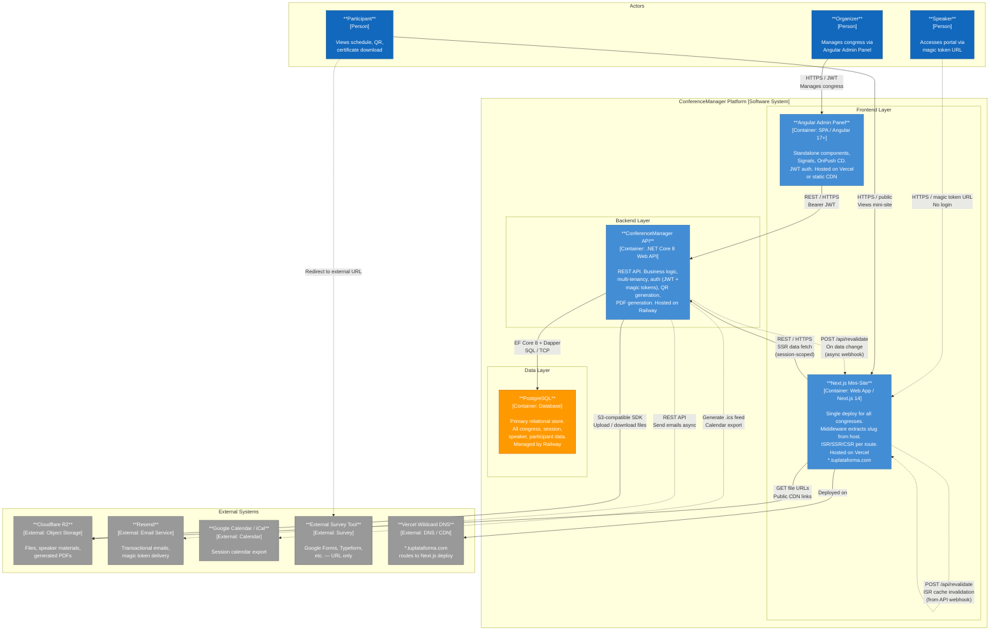

# C4 Level 2 — Container Diagram: ConferenceManager

## Container Descriptions

| Container | Technology | Responsibility |
|---|---|---|
| **Angular Admin Panel** | Angular 17+, standalone components, Signals, OnPush | Full CRUD for organizer: congress, sessions, speakers, participants, branding. JWT-authenticated. |
| **Next.js Mini-Site** | Next.js 14 App Router, single Vercel deploy | Public-facing congress site. Middleware extracts `slug` from hostname, routes are ISR/SSR/CSR based on data volatility. |
| **ConferenceManager API** | .NET Core 8 Web API, Railway | Core business logic: multi-tenancy, auth, QR/PDF generation, file orchestration, ISR webhooks. |
| **PostgreSQL** | PostgreSQL 16, Railway managed | Authoritative relational store for all domain data. Accessed via EF Core 8 (migrations, LINQ) and Dapper (complex read queries). |

## Key Flows

1. **Congress management** — Organizer uses Angular Admin Panel; all mutations go through the API with JWT auth; API writes to PostgreSQL; API fires `POST /api/revalidate` to Next.js to invalidate ISR cache.
2. **Speaker portal** — Speaker follows magic-token URL on Next.js mini-site; Next.js calls API to validate token; speaker uploads materials via API, which stores them in Cloudflare R2.
3. **Participant certificate** — Participant submits email on mini-site; Next.js calls API; API verifies registration, generates PDF with PdfSharp, streams/stores via R2, returns download URL.
4. **Subdomain routing** — Vercel wildcard DNS `*.tuplataforma.com` routes all subdomains to the single Next.js deploy; Next.js middleware reads `x-forwarded-host` / `host`, extracts slug, injects `x-congress-slug` header for downstream Server Components and API calls.

---
*Date: 2026-04-26 | Author: Architect (ARCH)*
