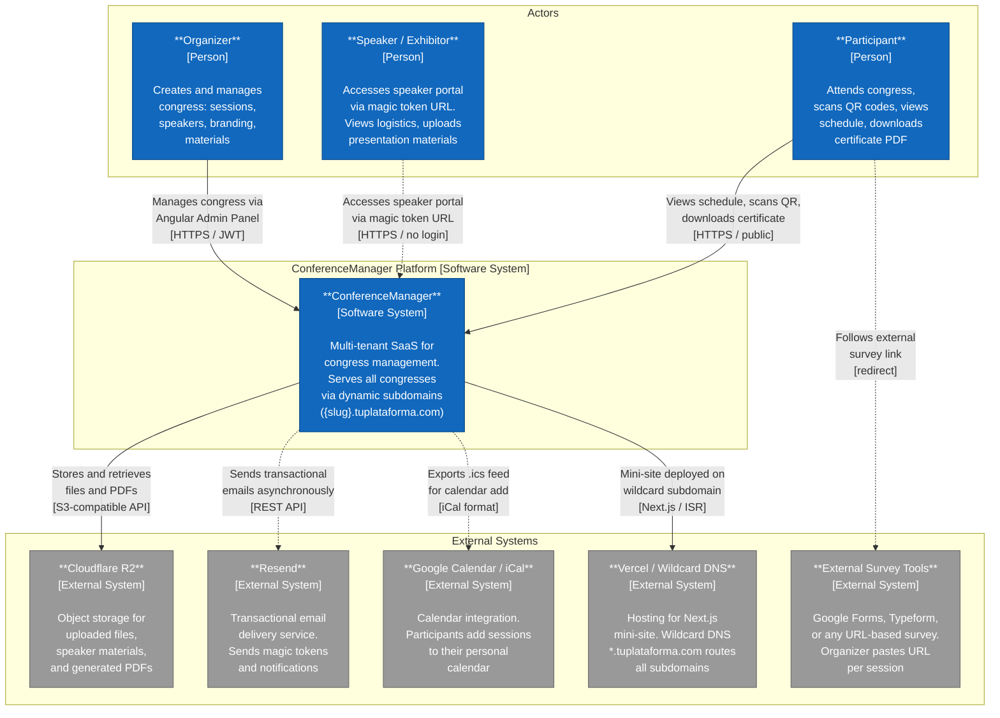

# C4 Level 1 — System Context Diagram: ConferenceManager

## Narrative

ConferenceManager is a multi-tenant SaaS platform that allows **Organizers** to create and fully manage academic or professional congresses through a dedicated Angular-based admin panel (JWT-authenticated). Each congress is served under a dynamic subdomain (`{slug}.tuplataforma.com`) powered by a single Next.js deployment on Vercel.

**Speakers** receive a magic-token URL via email — no account or password required — granting them access to their personalized portal where they upload presentation materials and view their logistics.

**Participants** interact with the public-facing mini-site: browsing the schedule, scanning QR codes at venue gates, adding sessions to their calendar, and downloading attendance certificates (PDF generated on-demand server-side).

File storage is delegated to **Cloudflare R2** (S3-compatible). Email delivery uses **Resend**. External surveys (Google Forms, Typeform, etc.) are linked per session — the platform does not host forms.

---
*Date: 2026-04-26 | Author: Architect (ARCH)*
